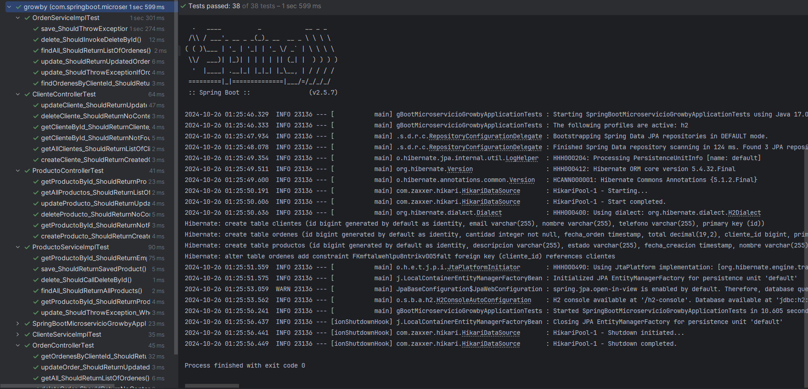

# Microservicio Growby

## Descripción

Este proyecto es un microservicio desarrollado en Java con Spring Boot que gestiona la creación y manejo de clientes, órdenes y productos. El servicio ofrece endpoints para realizar operaciones CRUD (Crear, Leer, Actualizar y Eliminar) sobre estas entidades.

## Tecnologías Utilizadas

- **Java 11**: Lenguaje de programación utilizado.
- **Spring Boot**: Framework para crear aplicaciones Java.
- **Spring Data JPA**: Para el manejo de la persistencia de datos.
- **H2 Database**: Base de datos en memoria para desarrollo y pruebas.
- **Lombok**: Para reducir el código boilerplate.
- **Swagger**: Para la documentación y pruebas de los endpoints.
- **JUnit**: Para realizar pruebas unitarias.

## Estructura del Proyecto

- **Controller**: Maneja las solicitudes HTTP y la interacción con el servicio.
- **Service**: Contiene la lógica de negocio.
- **Repository**: Interactúa con la base de datos.
- **Model**: Representa las entidades del dominio.
- **DTO**: Objetos de transferencia de datos.
- **Exception**: Manejo de excepciones personalizadas.

## Endpoints

### Cliente

| Método | Endpoint                  | Descripción                               |
|--------|---------------------------|-------------------------------------------|
| GET    | /clientes                 | Listar todos los clientes                 |
| GET    | /clientes/{id}            | Obtener un cliente por ID                 |
| POST   | /clientes                 | Crear un nuevo cliente                    |
| PUT    | /clientes/{id}            | Actualizar un cliente por ID              |
| DELETE | /clientes/{id}            | Eliminar un cliente por ID                |

### Orden

| Método | Endpoint                  | Descripción                               |
|--------|---------------------------|-------------------------------------------|
| GET    | /ordenes                  | Listar todas las órdenes                  |
| GET    | /ordenes/cliente/{id}     | Listar órdenes por ID de cliente          |
| POST   | /ordenes                  | Crear una nueva orden                     |
| PUT    | /ordenes/{id}            | Actualizar una orden por ID               |
| DELETE | /ordenes/{id}            | Eliminar una orden por ID                 |

### Producto

| Método | Endpoint                  | Descripción                               |
|--------|---------------------------|-------------------------------------------|
| GET    | /productos                | Listar todos los productos                |
| GET    | /productos/{id}           | Obtener un producto por ID                |
| POST   | /productos                | Crear un nuevo producto                   |
| PUT    | /productos/{id}           | Actualizar un producto por ID             |
| DELETE | /productos/{id}           | Eliminar un producto por ID               |

## Casos de Prueba

### Cliente

1. **Crear Cliente**
    - **Método**: POST
    - **Endpoint**: `/clientes`
    - **Request Body**:
      ```json
      {
        "nombre": "Juan Pérez",
        "email": "juan.perez@example.com",
        "telefono": "123456789"
      }
      ```
    - **Expected Response**: 201 Created

2. **Listar Clientes**
    - **Método**: GET
    - **Endpoint**: `/clientes`
    - **Expected Response**: 200 OK, Array de clientes

3. **Actualizar Cliente**
    - **Método**: PUT
    - **Endpoint**: `/clientes/{id}`
    - **Request Body**:
      ```json
      {
        "nombre": "Juan Pérez Actualizado",
        "email": "juan.perez.updated@example.com",
        "telefono": "987654321"
      }
      ```
    - **Expected Response**: 200 OK

4. **Eliminar Cliente**
    - **Método**: DELETE
    - **Endpoint**: `/clientes/{id}`
    - **Expected Response**: 204 No Content

### Orden

1. **Crear Orden**
    - **Método**: POST
    - **Endpoint**: `/ordenes`
    - **Request Body**:
      ```json
      {
      "cantidad": 5,
      "fechaOrden": "2024-10-25T10:00:00Z",
      "clienteId": 1,
      "productoId": 2
      }
      ```
    - **Expected Response**: 201 Created

2. **Listar Órdenes**
    - **Método**: GET
    - **Endpoint**: `/ordenes`
    - **Expected Response**: 200 OK, Array de órdenes

3. **Listar Órdenes por Cliente**
    - **Método**: GET
    - **Endpoint**: `/ordenes/cliente/{id}`
    - **Expected Response**: 200 OK, Array de órdenes

4. **Actualizar Orden**
    - **Método**: PUT
    - **Endpoint**: `/ordenes/{id}`
    - **Request Body**:
      ```json
      {
        "cantidad": 10,
        "total": 200.00
      }
      ```
    - **Expected Response**: 200 OK

5. **Eliminar Orden**
    - **Método**: DELETE
    - **Endpoint**: `/ordenes/{id}`
    - **Expected Response**: 204 No Content

### Producto

1. **Crear Producto**
    - **Método**: POST
    - **Endpoint**: `/productos`
    - **Request Body**:
      ```json
      {
      "nombre": "Laptop",
      "descripcion": "Laptop de alta gama",
      "precio": 1500.00,
      "estado": "Activo"
      }
      ```
    - **Expected Response**: 201 Created

2. **Listar Productos**
    - **Método**: GET
    - **Endpoint**: `/productos`
    - **Expected Response**: 200 OK, Array de productos

3. **Actualizar Producto**
    - **Método**: PUT
    - **Endpoint**: `/productos/{id}`
    - **Request Body**:
      ```json
      {
        "nombre": "Producto A Actualizado",
        "precio": 55.00
      }
      ```
    - **Expected Response**: 200 OK

4. **Eliminar Producto**
    - **Método**: DELETE
    - **Endpoint**: `/productos/{id}`
    - **Expected Response**: 204 No Content

## Cómo Probar

1. **Swagger UI**: Visita `http://localhost:8080/swagger-ui.html` para interactuar con la API y probar los endpoints.
2. **Postman**: Puedes usar Postman para probar los endpoints. Asegúrate de configurar las cabeceras necesarias (por ejemplo, `Content-Type: application/json`).

## Instrucciones de Configuración

1. Clona el repositorio:
   ```bash
   git clone https://github.com/tu_usuario/growby.git

2. Construye el proyecto con Maven:
   mvn clean install

3. Ejecuta la aplicación:
   mvn spring-boot:run

4. Asegúrate de tener el puerto 8080 disponible.

